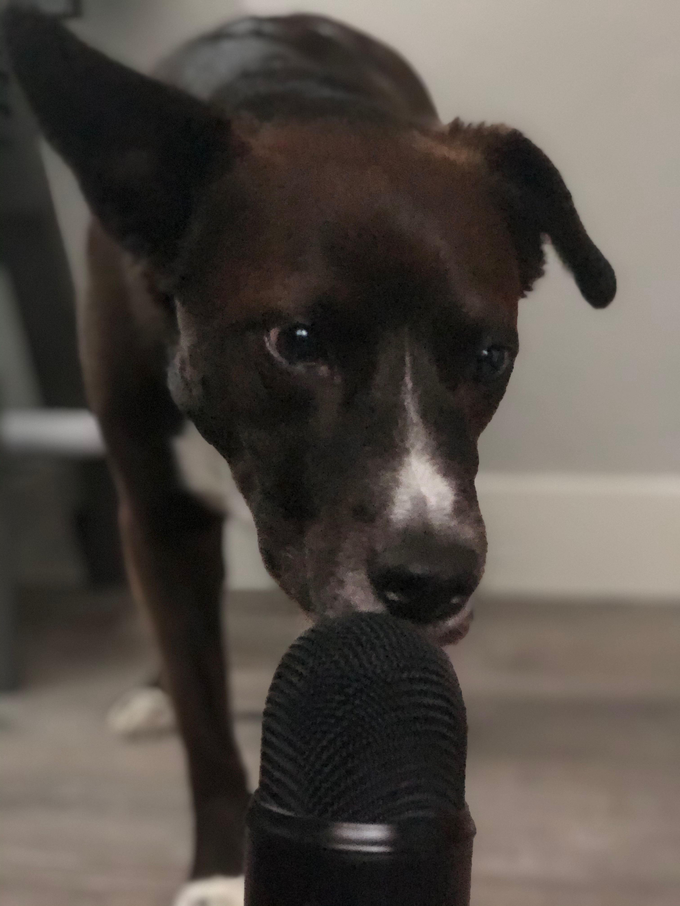

# Welcome{#welcome}

Hello! If you’re reading this, you’re probably a member of the Personality Is Everywhere (PIE) lab in the University of Oregon Psychology Department. We’re thrilled to have you on board, and we want you to know that we’re committed to creating a lab environment and experience that fosters intellectual creativity and studies scientific questions with rigor. We hope you’ll learn a lot about personality psychology and quantitative methods, that you’ll build new skills, make meaningful connections (and maybe even become friends) with other scientists, and have fun throughout the process. 

We started this manual for a number of reasons:

- To clearly communicate expectations and make sure everyone is on the same page
- As a central repository for information (lab policies, department policies, helpful online resources)
- To ensure that we are constantly evaluating our lab’s goals and values, and whether our policies are in line with those goals and values.
- As a place to share fun pictures:

```{r, echo=FALSE, out.width="50%", fig.cap="Speak, Po, speak.", fig.align = 'center'}

```
 

As you work in the lab, think of this manual as a how-to guide (but not all the time… sometimes, think of whatever it is you’re working on). We hope you’ll start here when you have a question. As we learn how to do new things, as our research methods and analyses change with the times, and as we expand our interests, this manual will change. Let us know if there are things we can or should add. (Or, if you have the appropriate authority on GitHub, go ahead and add resources yourself.)

When you join the lab, please make sure you read the following sections:

- [What we do and why we do it](#whatwedo)
- [Expectations](#roles) (know what’s expected of you and what you can expect of others)
- Onboarding
- [Communication](#communication)
- [Logistics](#logistics)
- [Day-to-day information](#daytoday)
- [Code of Conduct](#codeofconduct)
- [Recurring events](#events)

This lab manual was inspired by other lab manuals and mentorship statements, specifically [Moin Syed](https://osf.io/qysm2/), [Samuel Mehr](https://thebiologist.rsb.org.uk/biologist/158-biologist/features/2299-how-to-write-a-lab-handbook), and [the Aly Lab](https://github.com/alylab/labmanual/blob/master/aly-lab-manual.docx). We borrow heavily from them in some places, and we’re grateful for their making their work open for us to use. This manual is a work-in-progress and always will be. We plan to reevaluate the manual regularly. If you have ideas about things to add or clarify, let us (David and Sara, the PI’s) know. 

<a rel="license" href="http://creativecommons.org/licenses/by/4.0/"></a><br />This work is licensed under a <a rel="license" href="http://creativecommons.org/licenses/by/4.0/">Creative Commons Attribution 4.0 International License</a>.

This lab manual is licensed under a Creative Commons Attribution - NonCommercial 4.0 International License. If you’re a PI or a trainee in a different lab and want to write your own lab manual, feel free to take inspiration from this one (and cite us!).
