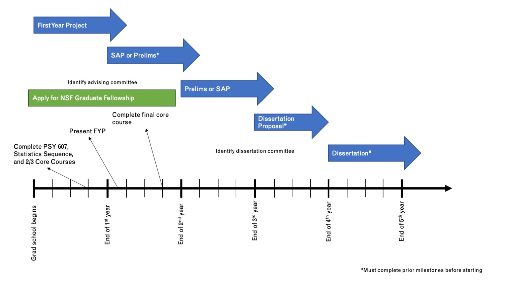

# Mentorship of graduate students

## PI Mentorship Philosophy

One of our goals is to help you thrive in your chosen career. This means going beyond the minimum requirements of the graduate program (i.e., classes, first year project, quals, dissertation, etc). We aim to prepare you for the requirements of your career by helping you learn and practice the skills needed to be successful. Our default assumption is that you are seeking a career that involves  research skills. In both academic and industry settings, the skills required to conduct research have much in common. These include:

- Working with data, including data collection, analysis, cleaning, management and storage, and visualization
- Summarizing research in written form and presenting summaries of research to small and large audiences
- Integrating new knowledge into your understanding
- Constructively critiquing research methods, of others and yourself
- Thinking for yourself
- Figuring things out for yourself

There’s a lot to learn in graduate school; most of it is learned and practiced outside of the classroom. We commit to helping you make the most of graduate school by identifying your strengths and areas for growth, and providing opportunities to practice what you need and advance where you can excel. Your training will not look the same as the other students’. We are an individual differences lab, after all. In the process, we will help you pursue research questions that you find interesting and exciting, while guiding you to build a research identity that you can easily communicate to others. 

Because we are both researchers at an R1 institution, our approach to mentorship will necessarily focus on research training. Do not let this deter you from learning more about other careers you can pursue with a Ph.D. Remember our number one goal is that you thrive -- this means not just being good at your future career but that you enjoy doing it. 

In the course of your training, you may occasionally find yourself having to complete tasks that you do not particularly enjoy! For example, nearly every graduate student feels great discomfort presenting research in front of an audience. We will only push you to do things that we strongly believe will help you develop skills or resources that will benefit you in the long run. If you’re feeling uncomfortable about something we’ve asked you to do, come talk to us. We can decide together whether this is worth doing and, if so, how we can help you prepare as best as possible. If you hide your discomfort, we can’t help.

Above all else, communicate with us. Let us know what future you envision for yourself, what your values and goals are, and whenever you change your mind. Let us know what parts of your training are fun and exciting and which parts are boring or scary. Let us know when we’re meeting your needs and when we are not. Whenever possible, name the experience you’re having, even if you don’t have a solution for it. We promise to do the same -- we will give you feedback throughout your time here on where you’re succeeding and where you need to work, and what to focus on moving forward. Be open to feedback. Know that we are open to feedback. Giving feedback requires a surprisingly large amount of time and effort, and feedback should always be accepted with gratitude. Even if you never act on our feedback, always consider it given with respect and the best intentions. We will do the same for you.

## Primary mentors

Your primary mentor will be the PI nominally responsible for your well-being and career success. While both of us will be heavily involved in your training, we believe that the primary-mentor model reduces issues of diffused responsibility and also gives you a “first point of contact” for all your concerns and questions.

Each graduate student will be assigned a primary mentor (either Sara or David) before they arrive on campus. For the first year, this will largely be an arbitrary designation. Graduate students should expect to meet with both PIs regularly during their first year and to collaborate with both mentors on their FYP. We recommend bringing questions to your primary mentor (this will help spread out mentorship work between the PIs) or lab meetings, so we can share knowledge with the entire group.

Towards the end of Spring term during the first year, the student should discuss with Sara and David which PI is the best fit for them personally. This decision should account for research interests as well as mentoring style. Keep in mind that our number one goal is your career success: this is not a conversation about which one of us you like more, but which mentor will best help you flourish. Also keep in mind that on our end, we may push you one way or another, if we feel that either some aspects of fit are more important than others or if we’re in danger of one PI taking on too much primary mentorship. 

You may choose to have both PIs on your committees (FYP, Advising, SAP, Prelims, Dissertation) or just your primary mentor. For all committees, you must have two faculty members outside of the PIE lab. 

## Recommendation Letters

Letters of recommendation are extremely important for getting new positions and grants. You can count on us to write you a letter if you have been in the lab at least two terms. Exceptions can be made if students are applying for fellowships shortly after starting in the lab. 

If you need a letter, notify the ideal letter-writer as soon as possible with the deadline, your CV, and any relevant instructions for the content of the letter. If the letter is for a grant, also include your specific aims. In some cases (especially if short notice is given), you may also be asked to submit a draft of a letter, which will be modified based on our experience with you, made more glamorous, and edited to add anything you left out that we think is important. This will ensure that the letter contains all the information you need, and that it is submitted on time.

## Individual Development Plans (IDPs)

Students will regularly complete/update an IDP. A good template is [myIDP](http://myidp.sciencecareers.org/) but students may use another format. Twice a year, students will receive feedback from the mentors on the skills related to their IDP (i.e., skills needed for careers of interest), with the goal of starting a conversation around planning training goals (short- and long-term).

## UO Program Requirements

[Doctoral student forms](https://psychology.uoregon.edu/graduate/current-students/doctoral-program/handbooks-student-forms/)

### Coursework (required)

See [course information organized by Lori Olsen](articles/Required Courses F20.doc) (last updated July 2020)
- 3-term statistics sequence (PSY 611-613)
- Professional seminar (PSY 607, each term first year)
- Three of five core courses (usually listed as PSY 610):
    - Systems Neuroscience
    - Cognitive Neuroscience
    - Social/Personality
    - Developmental
    - Psychopathology

**Additional courses worth considering**
  - Structural Equation Modeling (PSY 610)
  - Multilevel Modeling (PSY 607)
  - [Data Science Specialization Sequence](https://github.com/uo-datasci-specialization) (5 courses) in the College of Education (EDLD 610)

### Expected Timeline{#timeline}

The above timeline is just an approximation. There are some hard deadlines, like completing your FYP by November of your second year, but the rest are more guidelines.

You should plan on completing your degree in five years. This is in part due to funding (i.e., we cannot guarantee that there will be funding available for a sixth year), and in part to maximize your career prospects. A sixth year may be considered for exceptional circumstances that disrupt your productivity, although this shouldn't be a point of disucssion until the end of your fourth year. 

### First-Year Project (FYP)
  
  - To help beginning students develop and demonstrate their abilities as researchers, first-year
students in the Ph.D. program are expected to design a research project, obtain and analyze data,
and write a report in publishable format describing their work (“First-Year Project”). In some
circumstances, it may be impossible to design a study, collect data, and analyze data all within
one year, such as in longitudinal research or large sample clinical studies. In such cases, students
may address a novel question in an existing data set. The scope of the work for the first year
project needs to be agreed upon within student’s First Year Committee. Accompanying this
process, the First-Year Research Series (Psy 607) serves as a forum for students to discuss their
ideas for the First-Year Project and to learn about some of the practicalities of conducting
research at the University of Oregon. Students should also work closely with their First-Year
Committee and obtain assistance and guidance for the project. 
- To be completed by November of your second year
  - Presented to department during First Year Talks in October of your second year

### Supporting Area Project (SAP)

  - The goal of the Supporting Area project (SAP) is to provide breadth to the student’s training,
within a new content domain and/or with new research methodology to which they would not
normally be exposed in their primary lab. In addition, it provides students with an opportunity to
work closely with a faculty mentor other than their primary advisor, so as to gain experience
with a different mentoring style, and to provide an opportunity to cultivate a relationship with
another person who could later provide a detailed letter of recommendation for grant or job
applications. 
- Typically done during second or third year

### Prelims

  - The Major Preliminary Examination (“Prelims”) provides an opportunity for students to integrate their
knowledge of a relatively broad area of psychology (e.g., traditionally developmental, social, clinical,
cognitive, or physiological, and more recently developmental psychopathology, emotion, or cognitive
neuroscience) and to demonstrate their scholastic competence in this area. Students are ready to Advance
to Candidacy after the completion of the SAP and Prelims (and, for clinical students, all clinical
coursework and practica).
- Typically done during your second or third year

### Dissertation Proposal

  - The Dissertation Proposal has several functions: First, it encourages the student to think through details of hypothesis formation, design, and analysis strategies in advance of data collection. Second, the student and the dissertation committee arrive at shared expectations regarding the scope of the dissertation and details in design, data collection, and analysis. That way, unwelcome surprises for both parties (e.g., an advisor’s request for more studies or a student’s failure to provide certain analyses) are made less likely. Third, when new faculty are added to a dissertation committee at a time when data collection has already been completed (which may be true for the outside member), the newly added member can consult a document that specifies the goals of the dissertation and can thus more fairly assess the success of the completed dissertation in meeting these goals.
  - Typically completed by the end of your fourth year

### Dissertation

- The doctoral dissertation is a major project that demonstrates the student’s ability to act as an independent researcher and scholar. The dissertation should be planned in close cooperation with the Dissertation Committee. The University and Graduate School have established strict guidelines that must be followed in order to complete this final step in the graduate program.
- At least five weeks before the oral defense is held, begin the **Application for Final Oral Defense** process (formerly known as Confirmation of Agreement to
Attend). Return to your Advanced Degree Application on GradWeb, in the Oral Defense module, enter the date/time/location of the oral defense. Each dissertation committee member will receive an automated email and they must respond via GradWeb. Once all members have responded, this becomes the Application for Final Oral Defense. The Graduate Secretary secures the signatures of the Department Head and Graduate Education Committee Chair. This document must be at the Graduate School _three weeks before_ the oral defense.
- A formal oral defense of the dissertation on the Eugene campus is mandatory before the Ph.D. degree can be granted. The defense is usually held during the term in which the degree will be granted, and must be scheduled three weeks in advance of the defense date. At this time the committee members should be presented with a copy of the dissertation in final form. Students should not request that their committee accept an incomplete or draft copy of the dissertation. If, in the judgment of the student and his/her adviser, the dissertation is not complete three weeks prior to the defense, the oral defense should be rescheduled. Committee members should not agree to sit for an oral defense if they have not received a complete and final copy of the dissertation at the appropriate time.
- Dissertations are submitted electronically. Please view the submission procedures on the Graduate School’s site for the latest information. If approval of the dissertation is not unanimous, a review procedure will be established by the Dean of the Graduate School.
