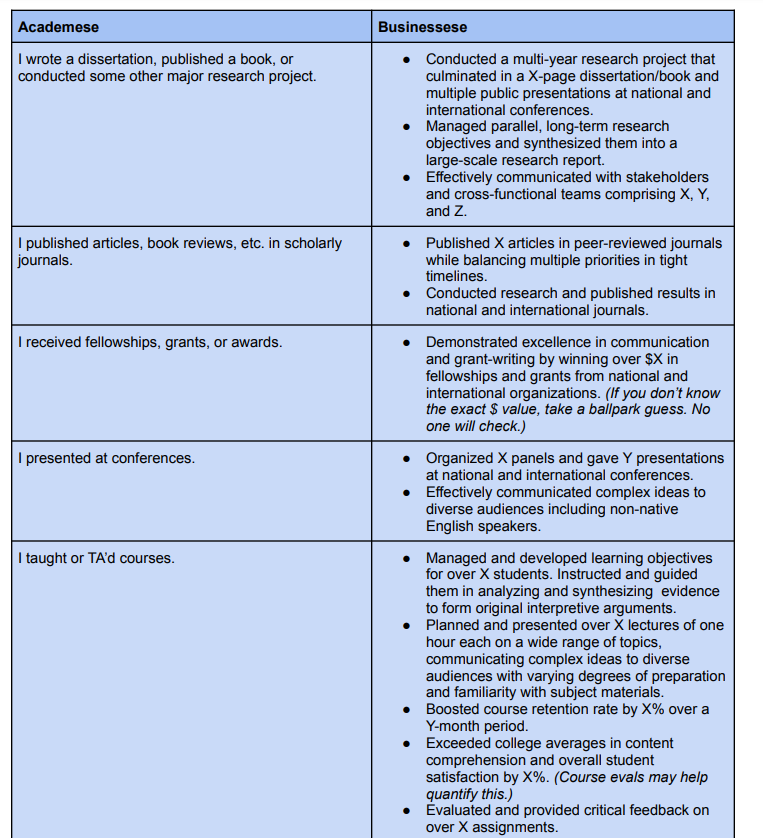

# Tutorials and Links

## R and RMarkdown

- [Big Book of R](https://www.bigbookofr.com/) -- A collection of every book using R!

### Beginners

- [R for Data Science](https://r4ds.had.co.nz/)
- [YaRrr! The Pirate's Guide to R](https://bookdown.org/ndphillips/YaRrr/) -- this one is great for undergraduates
- [Learning Statistics with R](https://learningstatisticswithr-bookdown.netlify.app/)
- [Cookbook for R](http://www.cookbook-r.com/)
- [R for Psychological Science](http://psyr.djnavarro.net/)

### Cheatsheets

All cheatsheets can be downloaded [here](https://rstudio.com/resources/cheatsheets/).

Especially useful cheatsheets include:

- RMarkdown Reference
- Data Viz
- Transformation
- Iteration
- Purrr
- Stringr

### Data Visualization

- [How to make better spaghetti plots](https://njt-rstudio20.netlify.app/#1)
- [DiagrammR](http://rich-iannone.github.io/DiagrammeR/index.html) -- flowcharts and diagrams
- [DAG models](https://ggdag.malco.io/articles/intro-to-dags.html)
- [Twitter thread of tutorials by \@CedScherer](https://twitter.com/CedScherer/status/1441126976870252548)

### Markdown

- [RMarkdown: The Definitive Guide](https://bookdown.org/yihui/rmarkdown/)
  
  - See the section on [Websites](https://bookdown.org/yihui/rmarkdown/websites.html)
  
- [Advanced R Markdown (customization and extensions)](https://slides.yihui.org/2019-rstudio-conf-rmarkdown-workshop.htm#1) -- lots of useful tips in here, once you're familiar with Markdown.
  
- [Awesome tables with kable (PDF)](https://haozhu233.github.io/kableExtra/awesome_table_in_pdf.pdf)
- [Awesome tables with kable (HTML)](http://haozhu233.github.io/kableExtra/awesome_table_in_html.html)
- [How to convert a Google doc to RMarkdown](https://www.storybench.org/convert-google-doc-rmarkdown-publish-github-pages/)
- [Making slides](https://arm.rbind.io/slides/xaringan.html#1)

### Using Zotero with RMarkdown

1. [Download and install](https://www.zotero.org/download/) Zotero.
2. [Download and install](https://retorque.re/zotero-better-bibtex/installation/) the Better BibTex add-on.
3. Open Zotero, and go to Preference.
    - Under the Export tab, make sure Default Format is "Better BibTex Citation Key Quick Copy."
    - Under the Better BibTex tab, make sure the Citation key format is something you'll find useful. (I recommend `[auth:lower][veryshorttitle:lower:alphanum][year]`). 
4. At this point, you can choose to export your Zotero library to a .bib file, save it to the working directory of your RMarkdown file, and make sure the bibliography line is pointing to that file. Once that's done, you can simply drag from Zotero to your RMarkdown file, to create in-line citations, and the references section at the end will be created for you.

OR, you can install the `citr` package, which works with your Zotero library, so you don't need to create a new .bib file manually for each paper. Seems really convenient! ([More information here](https://github.com/crsh/citr).)

### GitHub

- [Happy Git with GitHub and R](https://happygitwithr.com/)
- [Cheatsheet for terminal commands](https://gist.github.com/cferdinandi/ef665330286fd5d7127d)

### Downloading direct from source

- [Downloading surveys into R directly from Qualtrics](https://cran.r-project.org/web/packages/qualtRics/vignettes/qualtRics.html).

### Text Analysis

- [Text mining Twitter with TidyText](https://www.earthdatascience.org/courses/earth-analytics/get-data-using-apis/text-mining-twitter-data-intro-r/) -- includes n-gram network plot
- [Word vectors with tidy data principles](https://www.r-bloggers.com/word-vectors-with-tidy-data-principles/)

### Iteration

- [Purrr](https://emoriebeck.github.io/R-tutorials/purrr/)

### Writing functions

- [Non-standard evaluation](http://adv-r.had.co.nz/Computing-on-the-language.html)

### Making tables

- [Awesome tables with kable (PDF)](https://haozhu233.github.io/kableExtra/awesome_table_in_pdf.pdf)
- [Awesome tables with kable (HTML)](http://haozhu233.github.io/kableExtra/awesome_table_in_html.html)
- [`gt` package](https://themockup.blog/static/gt-cookbook.html)
- The [`tableby` package](https://cran.r-project.org/web/packages/arsenal/vignettes/tableby.html) is excellent for descriptive statistics, as it can calculate central tendency/variability for continuous variables and counts for categorical variables and integrate them into a single table. If you want descriptives by group (e.g., a treatment/control or by gender), it will also calculate those and statistical tests ($t$ and $\chi^s$ both!).
- The [`modelsummary` package](https://vincentarelbundock.github.io/modelsummary/articles/modelsummary.html) seems very useful and customizable. May also work with all outputs from Markdown and Quarto, unlike sjPlot.

### Reproducibility

- [8 things to make research more findable](http://datacolada.org/69)
- Ensure that the correct versions of packages are loaded using the [`groundhog` package](http://datacolada.org/100).


### US Census API

This is a short tutorial on using the US Census API in word. 

You'll need the following:
 * an API key. You can request one at [https://api.census.gov/data/key_signup.html](https://api.census.gov/data/key_signup.html). 
  * the R package `censusapi`
  
Your key is used to access the API when working in R. It's not recommended that you share your key with anyone, nor is anyone allowed to use your key to access the API. For that reason, we recommend creating an R script (`census-api-key.R`) inside your project folder that assigns your key to an object. This script only needs to contain a single line of code:


```r
census_key = "Your Key Here"
```

Do not share this script with anyone. If using GitHub, add the path to this script to the .gitignore file. You can see the .gitignore for this project as an example.

To use the API, load the `censusapi` package and source the key script. Then add the key to your R environment.


```r
library(censusapi)
source("census-api-key.R")
Sys.setenv(CENSUS_KEY=census_key)
```

There are many datasets in the API. You can see them by running the code:


```r
apis <- listCensusApis()
```

You can `View()` this object to sort through the datsets. The set of datasets most useful for linking with SAPA data are those from the American Community Survey, especially the 5-year surveys. Look for datasets with `acs` in the name or `acs5` for the 5-year files specifically. If there are surveys in multiple years, you'll need to know which year (vintage) you would like data from.

You can see the variables available in a survey using the `listCensusMetadata` function.


```r
vars = listCensusMetadata(
  name = "acs/acs5",
  vintage = 2019,
  type = "variables"
)
head(vars)
```

<table class="table" style="margin-left: auto; margin-right: auto;">
 <thead>
  <tr>
   <th style="text-align:left;"> name </th>
   <th style="text-align:left;"> label </th>
   <th style="text-align:left;"> concept </th>
   <th style="text-align:left;"> predicateType </th>
   <th style="text-align:left;"> group </th>
   <th style="text-align:left;"> limit </th>
   <th style="text-align:left;"> attributes </th>
   <th style="text-align:left;"> hasGeoCollectionSupport </th>
   <th style="text-align:left;"> required </th>
  </tr>
 </thead>
<tbody>
  <tr>
   <td style="text-align:left;"> B24022_060E </td>
   <td style="text-align:left;"> Estimate!!Total:!!Female:!!Service occupations:!!Food preparation and serving related occupations </td>
   <td style="text-align:left;"> SEX BY OCCUPATION AND MEDIAN EARNINGS IN THE PAST 12 MONTHS (IN 2019 INFLATION-ADJUSTED DOLLARS) FOR THE FULL-TIME, YEAR-ROUND CIVILIAN EMPLOYED POPULATION 16 YEARS AND OVER </td>
   <td style="text-align:left;"> int </td>
   <td style="text-align:left;"> B24022 </td>
   <td style="text-align:left;"> 0 </td>
   <td style="text-align:left;"> B24022_060EA,B24022_060M,B24022_060MA </td>
   <td style="text-align:left;"> NA </td>
   <td style="text-align:left;"> NA </td>
  </tr>
  <tr>
   <td style="text-align:left;"> B19001B_014E </td>
   <td style="text-align:left;"> Estimate!!Total:!!$100,000 to $124,999 </td>
   <td style="text-align:left;"> HOUSEHOLD INCOME IN THE PAST 12 MONTHS (IN 2019 INFLATION-ADJUSTED DOLLARS) (BLACK OR AFRICAN AMERICAN ALONE HOUSEHOLDER) </td>
   <td style="text-align:left;"> int </td>
   <td style="text-align:left;"> B19001B </td>
   <td style="text-align:left;"> 0 </td>
   <td style="text-align:left;"> B19001B_014EA,B19001B_014M,B19001B_014MA </td>
   <td style="text-align:left;"> NA </td>
   <td style="text-align:left;"> NA </td>
  </tr>
  <tr>
   <td style="text-align:left;"> B07007PR_019E </td>
   <td style="text-align:left;"> Estimate!!Total:!!Moved from different municipio:!!Foreign born:!!Naturalized U.S. citizen </td>
   <td style="text-align:left;"> GEOGRAPHICAL MOBILITY IN THE PAST YEAR BY CITIZENSHIP STATUS FOR CURRENT RESIDENCE IN PUERTO RICO </td>
   <td style="text-align:left;"> int </td>
   <td style="text-align:left;"> B07007PR </td>
   <td style="text-align:left;"> 0 </td>
   <td style="text-align:left;"> B07007PR_019EA,B07007PR_019M,B07007PR_019MA </td>
   <td style="text-align:left;"> NA </td>
   <td style="text-align:left;"> NA </td>
  </tr>
  <tr>
   <td style="text-align:left;"> B19101A_004E </td>
   <td style="text-align:left;"> Estimate!!Total:!!$15,000 to $19,999 </td>
   <td style="text-align:left;"> FAMILY INCOME IN THE PAST 12 MONTHS (IN 2019 INFLATION-ADJUSTED DOLLARS) (WHITE ALONE HOUSEHOLDER) </td>
   <td style="text-align:left;"> int </td>
   <td style="text-align:left;"> B19101A </td>
   <td style="text-align:left;"> 0 </td>
   <td style="text-align:left;"> B19101A_004EA,B19101A_004M,B19101A_004MA </td>
   <td style="text-align:left;"> NA </td>
   <td style="text-align:left;"> NA </td>
  </tr>
  <tr>
   <td style="text-align:left;"> B24022_061E </td>
   <td style="text-align:left;"> Estimate!!Total:!!Female:!!Service occupations:!!Building and grounds cleaning and maintenance occupations </td>
   <td style="text-align:left;"> SEX BY OCCUPATION AND MEDIAN EARNINGS IN THE PAST 12 MONTHS (IN 2019 INFLATION-ADJUSTED DOLLARS) FOR THE FULL-TIME, YEAR-ROUND CIVILIAN EMPLOYED POPULATION 16 YEARS AND OVER </td>
   <td style="text-align:left;"> int </td>
   <td style="text-align:left;"> B24022 </td>
   <td style="text-align:left;"> 0 </td>
   <td style="text-align:left;"> B24022_061EA,B24022_061M,B24022_061MA </td>
   <td style="text-align:left;"> NA </td>
   <td style="text-align:left;"> NA </td>
  </tr>
  <tr>
   <td style="text-align:left;"> B19001B_013E </td>
   <td style="text-align:left;"> Estimate!!Total:!!$75,000 to $99,999 </td>
   <td style="text-align:left;"> HOUSEHOLD INCOME IN THE PAST 12 MONTHS (IN 2019 INFLATION-ADJUSTED DOLLARS) (BLACK OR AFRICAN AMERICAN ALONE HOUSEHOLDER) </td>
   <td style="text-align:left;"> int </td>
   <td style="text-align:left;"> B19001B </td>
   <td style="text-align:left;"> 0 </td>
   <td style="text-align:left;"> B19001B_013EA,B19001B_013M,B19001B_013MA </td>
   <td style="text-align:left;"> NA </td>
   <td style="text-align:left;"> NA </td>
  </tr>
</tbody>
</table>

You'll also need to know the geography you're collecting from. You can see the available geographies with similar code:


```r
geo = listCensusMetadata(
  name = "acs/acs5",
  vintage = 2019,
  type = "geography"
)
head(geo)
```

<table class="table" style="margin-left: auto; margin-right: auto;">
 <thead>
  <tr>
   <th style="text-align:left;"> name </th>
   <th style="text-align:left;"> geoLevelDisplay </th>
   <th style="text-align:left;"> referenceDate </th>
   <th style="text-align:left;"> requires </th>
   <th style="text-align:left;"> wildcard </th>
   <th style="text-align:left;"> optionalWithWCFor </th>
  </tr>
 </thead>
<tbody>
  <tr>
   <td style="text-align:left;"> us </td>
   <td style="text-align:left;"> 010 </td>
   <td style="text-align:left;"> 2019-01-01 </td>
   <td style="text-align:left;"> NULL </td>
   <td style="text-align:left;"> NULL </td>
   <td style="text-align:left;"> NA </td>
  </tr>
  <tr>
   <td style="text-align:left;"> region </td>
   <td style="text-align:left;"> 020 </td>
   <td style="text-align:left;"> 2019-01-01 </td>
   <td style="text-align:left;"> NULL </td>
   <td style="text-align:left;"> NULL </td>
   <td style="text-align:left;"> NA </td>
  </tr>
  <tr>
   <td style="text-align:left;"> division </td>
   <td style="text-align:left;"> 030 </td>
   <td style="text-align:left;"> 2019-01-01 </td>
   <td style="text-align:left;"> NULL </td>
   <td style="text-align:left;"> NULL </td>
   <td style="text-align:left;"> NA </td>
  </tr>
  <tr>
   <td style="text-align:left;"> state </td>
   <td style="text-align:left;"> 040 </td>
   <td style="text-align:left;"> 2019-01-01 </td>
   <td style="text-align:left;"> NULL </td>
   <td style="text-align:left;"> NULL </td>
   <td style="text-align:left;"> NA </td>
  </tr>
  <tr>
   <td style="text-align:left;"> county </td>
   <td style="text-align:left;"> 050 </td>
   <td style="text-align:left;"> 2019-01-01 </td>
   <td style="text-align:left;"> state </td>
   <td style="text-align:left;"> state </td>
   <td style="text-align:left;"> state </td>
  </tr>
  <tr>
   <td style="text-align:left;"> county subdivision </td>
   <td style="text-align:left;"> 060 </td>
   <td style="text-align:left;"> 2019-01-01 </td>
   <td style="text-align:left;"> state , county </td>
   <td style="text-align:left;"> county </td>
   <td style="text-align:left;"> county </td>
  </tr>
</tbody>
</table>

To match with SAPA data, you'll want to use the ZCTA or zip code tabulation area geography. Then use the `getCensus` function to import data using the API. For example, if I wanted to extract the total number of households and people in each ZCTA to match with SAPA, I would use the following:


```r
uscensus <- getCensus(
    name = "acs/acs5/profile",
    vars = c("NAME", 
             "DP02_0001E",  # number of households
             "DP05_0001E"  # number of persons
             ), 
    region = "zip code tabulation area", regionin = "state:*",
    vintage = 2019)
```

See more in the `censusapi` [vignette](https://cran.r-project.org/web/packages/censusapi/vignettes/getting-started.html).

## Writing

- [Dan Simons -- writing guide](http://www.dansimons.com/resources/writing_tips.html)
- [EJ Wagenmakers -- Teaching graduate students how to write clearly](http://www.ejwagenmakers.com/2009/TeachingTipsWriting.pdf)
- [Writing Workshop](https://osf.io/z4n3t/) -- includes both tips on how to write (content), as well as the practice of writing regularly. This book also provide the foundation for starting a writing group. 
- [Practical Typography](https://practicaltypography.com/)

### Grammar and syntax

- [Verb tenses](https://academicguides.waldenu.edu/writingcenter/grammar/verbtenses)

### Finding articles

- [CrossRef](https://doi.crossref.org/simpleTextQuery) -- get DOI's quickly
- [Connected Papers](https://www.connectedpapers.com/) -- find other articles related to a specific research article

### Bibliography

- [Zotero](https://zotero.org)
- [ZBib](https://zbib.org/)

### Reviewing the literature
- [Guide from the University of South Australia](https://lo.unisa.edu.au/mod/page/view.php?id=489316)

### Responding to reviews

- [Workflow for R&R](https://getsyeducated.blogspot.com/2020/08/a-workflow-for-dealing-with-dread-of.html)

## Presentations

- [Public speaking for academics](https://mfr.osf.io/render?url=https%3A%2F%2Fosf.io%2Fd8wm9%2Fdownload)
- [Free PowerPoint templates](https://www.slidescarnival.com/category/free-templates)


## Authorship

- [tenzing](https://martonbalazskovacs.shinyapps.io/tenzing/) -- this is a useful Shiny app for creating text (for Word or papaja) that includes author affiliations and also creditorship using the CRediT system. Espescially handy for large teams. 

## Statistics

### Probability

- [Seeing Theory](https://seeing-theory.brown.edu/)

### Generalized Linear Model

- [Logistic regression is not fucked](http://jakewestfall.org/blog/index.php/2018/03/12/logistic-regression-is-not-fucked/)
- [Melt the clock: tidy time series analysis](https://slides.earo.me/rstudioconf19/#1)
- [_Causal Inference: What If_ by Miguel A. Hernán & James M. Robins](https://www.hsph.harvard.edu/miguel-hernan/causal-inference-book/) -- Chapter titles: A defintion of causal effect, Randomized experiments, Observational studies, Effect modification, Interaction, Graphical representation of causal effects, Confounding, Selection bias, Measurement bias, Random variability, Why model, IP weighting and marginal structural models, Standardization and the parametric g-function, G-estimation of structural nested models, Outcome regression and propensity scores, Instrumental variable estimation, Causal survival analysis, Variable selection for causal inference, Time-varying treatments, Treatment-confounder feedback, G-methods for time-varying treatments, Target trial emulation

### Machine learning+

- [Statistical rethinking](http://xcelab.net/rm/statistical-rethinking/)
- [Machine learning for psychologists: A gentle introduction](https://github.com/tyarkoni/ML4PS)

- [Specification curves](https://github.com/dcosme/specification-curves/blob/master/SCA_tutorial.md)

### Text analysis

- [Structual Topic Models](https://juliasilge.com/blog/evaluating-stm/)
- [Erin Buchanan (Stats of Doom) NLP](https://statisticsofdoom.com/page/natural-language-processing/)

### Statistical Power

- [Powering interactions](https://approachingblog.wordpress.com/2018/01/24/powering-your-interaction-2/)
- [Explore researcher degrees of freedom](https://joachim-gassen.github.io/2019/03/explore-your-researcher-degrees-of-freedom/)

### Structural Equation Modeling

- [Michael Hallquist's SEM course](https://psu-psychology.github.io/psy-597-SEM)
- [Erin Buchanan (Stats of Doom) SEM](https://statisticsofdoom.com/page/structural-equation-modeling/) 

### Mediation and Moderation
- [Erin Buchanan (Stats of Doom) Mediation/Moderation](https://statisticsofdoom.com/page/med-mod/)

### Longitudinal data analysis
- [Personality Development Collaborative](https://www.personalitydevelopmentcollaborative.org/) -- also includes links to datasets that may be useful.

### Item response theory
* [Edwards (2009) – An Introduction to Item Response Theory Using the Need for Cognition Scale](articles/edwards-2009.pdf)
  * I would recommend starting with this article. The journal is aimed at graduate student seminars, so it will be more targeted to general understanding and application among psychologists, rather than to quantitative psychologists. This covers the two-parameter model and the graded response model.
* [da Rocha et al. (2013) – An introduction to Rasch analysis for Psychiatric practice and research](articles/daRocha-etal-2013.pdf)
  * This one will be similar to the Edwards article in terms of being aimed at a more general audience. This article will cover a third type of IRT model: the Rasch model.
* [Cook et al. (2005) – Dynamic Assessment of Health Outcomes: Time to Let the CAT Out of the Bag?](articles/cook-etal-2005.pdf)
  * This is less about the practice of IRT itself but more an intro into some of the potential broader application, especially in medical and educational settings.
* [mirt vignette](articles/mirt-vignette.pdf)
  * This will walk through how to use the mirt package in R. I believe mirt can do all three types of models described above.
* Check out the [6-video series by Karon Cook](https://www.youtube.com/watch?v=SrdbllMYq8M).


## Graduate School

- [The Illustrated Guide to a Ph.D.](http://matt.might.net/articles/phd-school-in-pictures/)
- [Raul Pacheco's resources](http://www.raulpacheco.org/resources/) -- a good collection of tips for everything from time management, to how to read and write, to using social media.
- [Escaping the hamster wheel by Elliot Berkman](https://www.psychologytoday.com/us/blog/the-motivated-brain/201709/advice-grad-students-and-senior-faculty)

## Life

- Note that being a GE and having a research fellowship are considered different forms of compensation. [Here’s a guide to preparing your (2019) federal taxes](http://pfforphds.com/prepare-grad-student-tax-return/).

- [Diverse careers among applied psychologists](https://docs.google.com/spreadsheets/d/1oYlZ15ZCte8uZvbQLJKegQ6IliJ6QcDuNifmxRusYNQ/edit) -- contact list of psychologists working outside of academia

* Writing up your experiences on a resume (H/T: [Jin Goh](https://twitter.com/JinXunGoh/status/1501246061188427782))

## Applying to graduate school

* [Psych Research List](http://www.psychresearchlist.com) -- Lists of internships, virtual grad program information sessions, jobs, resources for applying to grad programs, etc.
* [Application Statement Feedback Program](https://www.asfp.io/applicants) -- A service providing feedback on research statements for those applying to Psychology graduate programs. 
