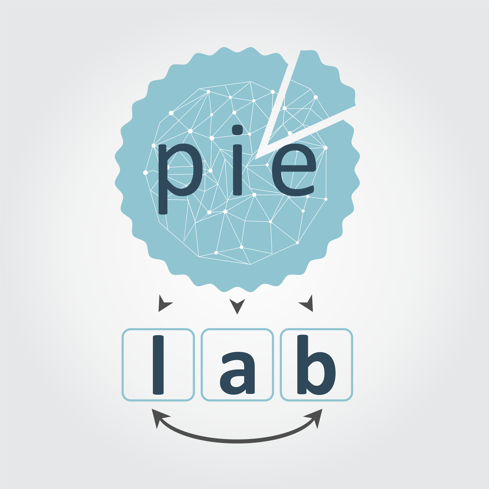

--- 
title: "PIE Lab Manual"
author: "The PIE lab"
date: "2020-07-03"
site: bookdown::bookdown_site
documentclass: book
bibliography: [book.bib]
biblio-style: apalike
link-citations: yes
cover-image: "images/PIElab5.png"
github-repo: pie-lab/manual
url: 'https\://pielab-science.com'
description: "Resources, standard operating procedures, tips, tricks, rules"

---

#  {-}

